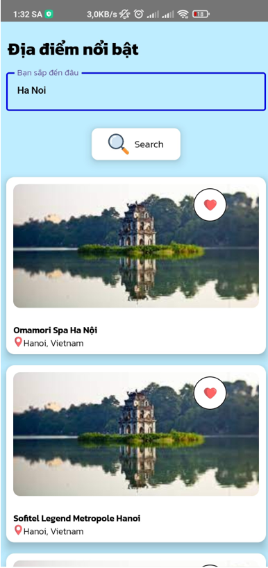

# App-Travel-Supporter

**App-Travel-Supporter** là một ứng dụng di động giúp người dùng dễ dàng tìm kiếm, khám phá và lên kế hoạch cho các chuyến du lịch của mình. Ứng dụng cung cấp nhiều tính năng hữu ích như tìm kiếm địa điểm du lịch, xem chi tiết thông tin về các địa điểm, phát hiện vị trí hiện tại và hướng dẫn người dùng đến các điểm du lịch gần nhất.

### Tính năng chính:
- **Tìm kiếm địa điểm**: Người dùng có thể tìm kiếm các địa điểm du lịch dựa trên tên, loại hình hoặc vị trí.
- **Xem chi tiết địa điểm**: Cung cấp thông tin chi tiết về địa điểm như mô tả.
- **Nhận diện địa danh**: Cho phép người dùng nhận diện địa danh thông qua hình ảnh

---

## Màn hình chính


Màn hình chính cung cấp các chức năng tìm kiếm và truy cập nhanh đến các tính năng chính của ứng dụng.

## Tìm kiếm



Màn hình tìm kiếm giúp người dùng dễ dàng tìm kiếm các địa điểm du lịch theo tên hoặc vị trí.

## Chi tiết địa điểm


Màn hình chi tiết cung cấp thông tin chi tiết về một địa điểm du lịch, bao gồm mô tả, hình ảnh và các thông tin liên quan. Có nút chỉ đường truyền vị trí địa điểm qua Google Maps để tiến hành chỉ đường

## Nhận diện địa danh


Nhận diện địa danh giúp người dùng tìm kiếm địa điểm dựa trên hình ảnh.

---

### Cài đặt và sử dụng

1. Clone repository.
    ```bash
    git clone https://github.com/yourusername/App-Travel-Supporter.git
    ```

2. Mở project trong Android Studio.

3. Cài đặt các dependencies và chạy ứng dụng trên thiết bị Android hoặc giả lập.
